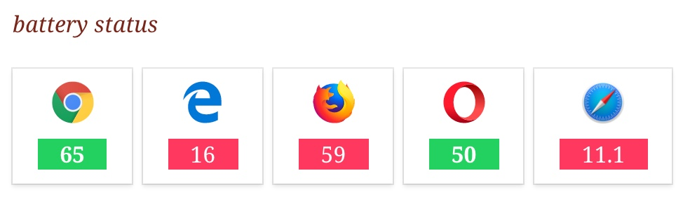

= "Can I Use" Extension for Asciidoctor.js

== Usage

In your document, use the `caniuse` macro with the name of the feature:

```
.battery status
caniuse:battery-status[]
```

Register the extension before converting your document:

```js
const asciidoctor = require('asciidoctor.js')()
const caniuseExtension = require('asciidoctor-caniuse.js')
const registry = caniuseExtension.register(asciidoctor.Extensions.create())

asciidoctor.convertFile('sample.adoc', {extension_registry: registry})
```

== Rendering



[NOTE]
====
You can use a `docinfo` file to add custom stylesheet.
See the `examples` directory.
====
